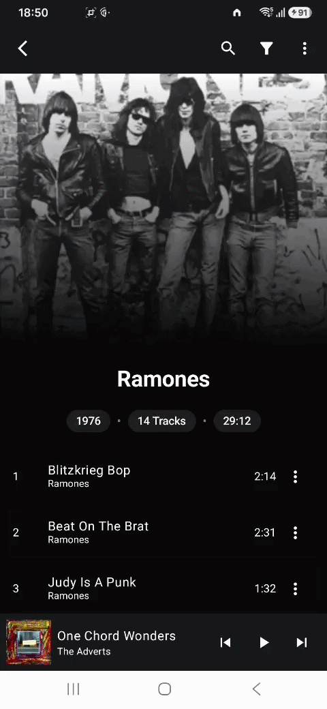
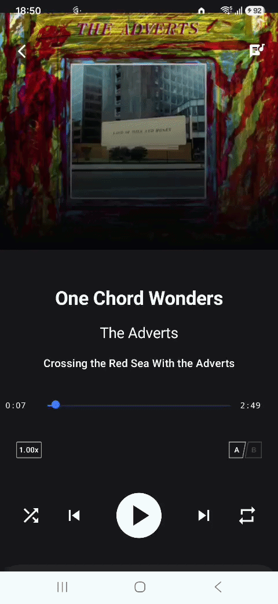
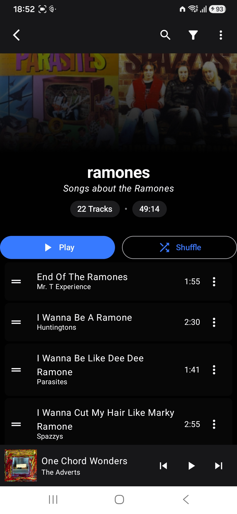
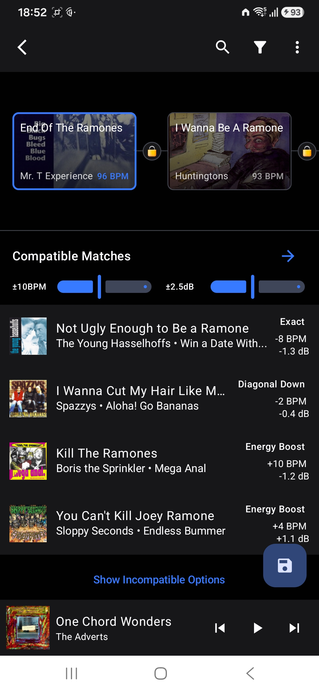
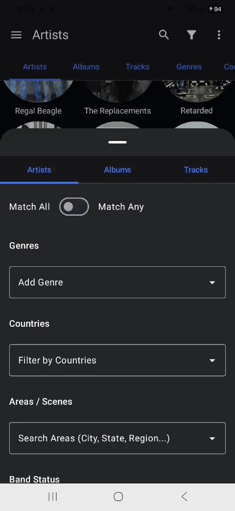

# DIY Player (Android Music Player)

An Android music player for local files. Features rich metadata from music metadata sources (Last.fm / MusicBrainz / Discogs / LRCLib), playlists, and advanced playback features. Built with Jetpack Compose, Room, Retrofit, Hilt, Media3/ExoPlayer, and offline-first design.

> Currently intended for personal use only (APK side-loaded, not published).

## Features

- Local library scanning (MediaStore / file URIs)
- Rich metadata 
	- bio, active years, similar artists
	- extensive location tagging and hierarchy, allowing the display of artists from the same local scene
	- record labels, genres
- Reorderable play queue with persistence across app restarts
- Now playing screen with playback controls (including A-B looping and playback speed control) and lyrics
- Playlist management (create, update, delete, import/export)
- Playlist sequencing helper using BPM, key compatibility (Camelot wheel), and perceived loudness
- Mood and audio feature tagging (implemented as a [Python API](https://github.com/janakuz/essentia-api))

## Tech stack

- Kotlin
- Jetpack Compose UI
- Room for local database
- Retrofit for API clients and networking
- Hilt for dependency injection
- Media3 / ExoPlayer for playback
- Coil for image loading
- Coroutines + Flow for reactive state
- Navigation Compose for in-app navigation

## Visual Showcase
| Artist & Local Scenes | Album Details | Now Playing & Lyrics |
|:---:|:---:|:---:|
|  |  |  |

  

| Playlists | Playlist Sequencer Engine | Filters |
|:---:|:---:|:---:|
|  |  |  |


🎥 High-Speed Walkthrough

[Screenshots/demonstration.mp4](Screenshots/demonstration.mp4)

## Getting Started

### Quick Install

1. Download the latest `DIY Player.apk`
2. Sideload and install the APK directly onto your Android device or emulator.
### Local Development Setup
#### Prerequisites

- Android Studio (Giraffe or later recommended)
- Android SDK matching `compileSdk` / `targetSdk` (see `build.gradle`)
- Emulator or physical device (grant `READ_MEDIA_AUDIO` or legacy storage permission)
- Git (for cloning)

#### Setup

1. Clone the repo:
   ```bash
   git clone <your-repo-url>
   cd <your-repo>
   ```

2. Open in Android Studio. Let it sync Gradle.
    
3. (Optional) If using a device/emulator, push a few audio files for initial testing:
	 ```bash	
	adb push /path/to/song.mp3 /sdcard/Music/
	```

4. Grant necessary runtime permissions on the device/emulator when prompted:
#### Running

- Build and run the app from Android Studio.
    
- Use the “Scan Library” button to populate artists/tracks from local storage.
    
- Navigate to the artists/albums/tracks screens. Playback and queue logic should work with the scanned data.
